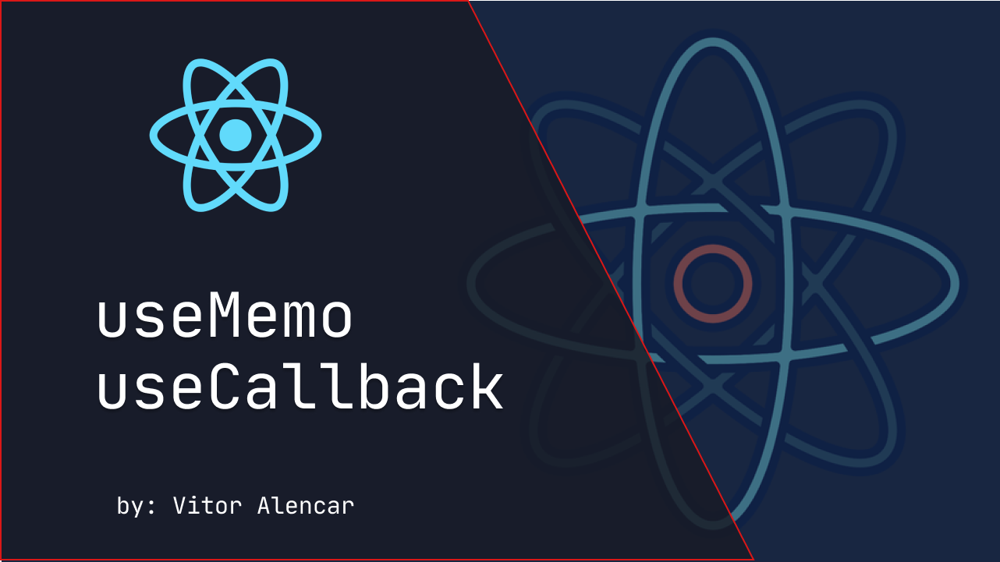

<h1 align="center">Memoization with hooks</h1>

<br>
<br>



<br>
<br>

## Getting Started

Clone the repository.

```sh
git clone https://github.com/vitormalencar/
```

`cd` into the directory.

```sh
cd hooks react-memoization-hooks
```

Install the project dependencies:

```sh
yarn

# or

npm install
```

Start the development server:

```sh
yarn start

# or

npm run start
```

🚀 Head over to [localhost:3000](http://localhost:3000) in your browser of choice.

💡 Pro tip use the `App.final.js` as you final reference guide

## Toolbelt

- [x] React as a UI language
- [x] TailwindCss UI as our design toolkit

## Project Structure

The project follows a regular [create-react-app](https://github.com/facebook/create-react-app) skeleton with very few modifications.

Under the src folder, we have two main directories:

- `App.js`: the place where the main logic for this workshop
- `components/`: Components reused across pages
- `utils.js`: Which contains, as the name suggests, utility shared funcitons,

## License

Designed with ♥ by [vitormalencar](https://vitormalencar.com). Licensed under the [MIT License](license).
